# 区块链浏览器说明

## 一、描述

### 1.1 基本描述

区块链浏览器将区块链中的数据可视化，并进行实时的展示。用户能够以Web页面的方式，方便的获取当前区块链中的信息。

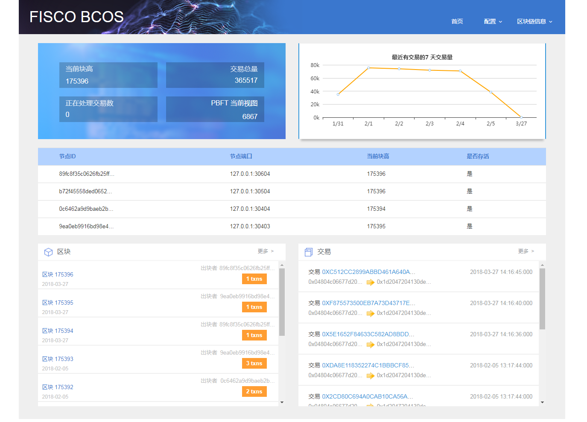

### 1.2 架构

区块链浏览器分为三个部分：server、page和report agent。

**server端**

- 定时从区块链节点的RPC接口中查数据，写入数据库中。
- 接收report agnet上报的数据，写入数据库中。

**page端**

- 可配置需要监控的区块链节点。
- 从数据库中拉取数据，在Web中展示。

**report agent**

- 部署在每台运行有区块链节点的机器上。
- 拉取区块链节点的监控数据，上报到server端。


注意：请使用chrome浏览器访问page。


## 二、区块链浏览器部署

### 1、环境

| 环境     | 版本              |
| ------ | --------------- |
| 浏览器    | chrome          |
| Java   | jdk1.8.0_121    |
| Python | 2.7             |
| gradle | gradle-2.1或以上版本 |
| 数据库    | mysql-5.6或以上版本  |
| Web服务  | Tomcat 9.0.1    |

环境部署方法请参考附录中的常见问题。

### 2、部署

### 2.1 clone代码

```shell
git clone http://github.com/FISCO-BCOS/fisco-bcos-browser.git
cd fisco-bcos-browser
```

### 2.2 浏览器部署

> 编辑文件

```sh
vim deploy_browser.sh
```

> 配置文件开头的参数，如下

```sh
######################  参数配置  ######################

userName="test"  #需要创建的数据库用户
password="123456" #需要创建的数据库用户密码
passwordRoot="123456" #数据库root账号的密码
dbName="bcos_browser"     #需要创建的数据库名
dbIp="192.168.1.100"   #数据库所在机器IP
tomcatpath="/software/tomcat/" #tomcat所在路径

###################### 参数配置结束 #################### 
```

> 运行脚本进行部署和启动

```sh
sh deploy_browser.sh
```

> 若执行成功，则浏览器服务会自动启动

### 2.3 节点上报程序（report agent）部署

每个部署了区块链节点的机器都需要部署report agent。参考：[监控上报脚本部署](report/README.md)


## 三、使用

>打开chrome浏览器，访问URL，如：

``` url
http://192.168.1.100:8080/fisco-bcos-browser
```

### 3.1 接入区块链节点

1. 进入页面：点击”配置“ -> ”节点配置“ ，进入页面。

2. 配置节点：点击“新增节点”，填入节点IP和RPC端口，点击“提交”，提交后，区块链浏览器后台自动连接相应区块链节点，拉取数据。尽可能将链上所有的节点都配置进去。

3. 查看数据：点击区块链浏览器的其它页面，查看区块链的相关数据。

4. 修改配置：在节点配置页面，点击节点列表上的操作按钮进行“修改”或“删除”。


**注意：目前区块链浏览器仅仅支持接入一条链，请勿配置多条链上的多个节点。** 

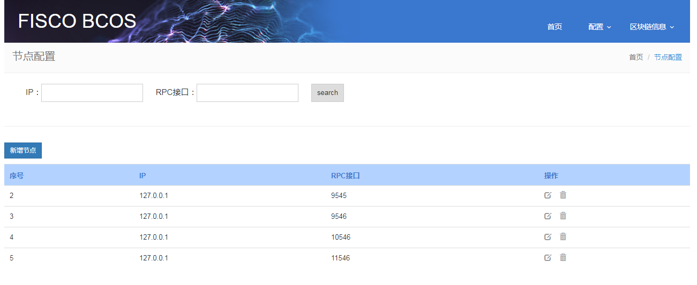

### 3.2 首页

首页展示了区块链的主要信息。

#### 3.2.1 全局信息

- 当前块高：描述区块链当前的最后一个块的高度，区块链上，无交易不出快，有交易块高会有变化。

- 交易总量：区块链上的所有交易数量总和。

- 正在处理交易数：链上正在处理的交易数。可表现区块链是否正常。若不出块，出现阻塞，则此数量会一直不为0。

- PBFT当前视图：共识算法PBFT中的参数。可描述区块链的状态。若无交易，此数量一直增加，有交易时，为某一较小的数。

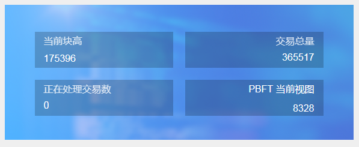

#### 3.2.2 交易量折线图

以天为单位显示交易量，当天无交易，则不显示当天的交易量。

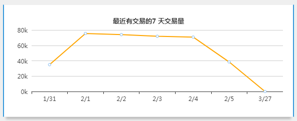

#### 3.2.3 节点状态列表

在节点配置页面中，仅需配置一个节点，此处就能显示链上所有活跃的节点。而对于发现某个节点变为非活跃的节点，则需要通过节点配置页面配置上相应的节点，才会实时跟踪相应节点是否活跃。

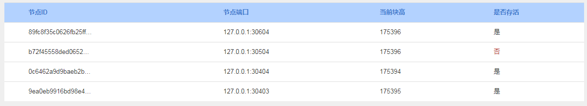

#### 3.2.4 区块、交易

显示最后5个区块或交易的简要信息。

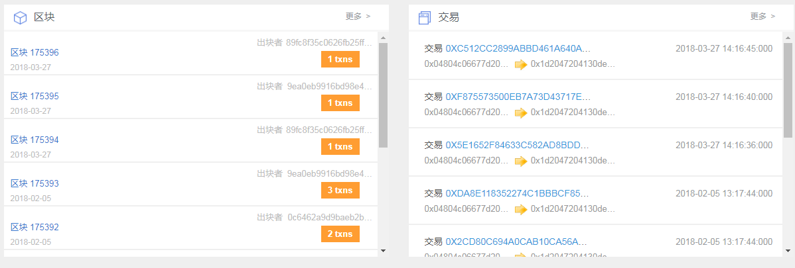

### 3.3 查看区块链信息

包括：查看区块、查看交易、正在处理的交易

功能：给出相应列表，支持哈希值模糊查询，生成时间筛选。

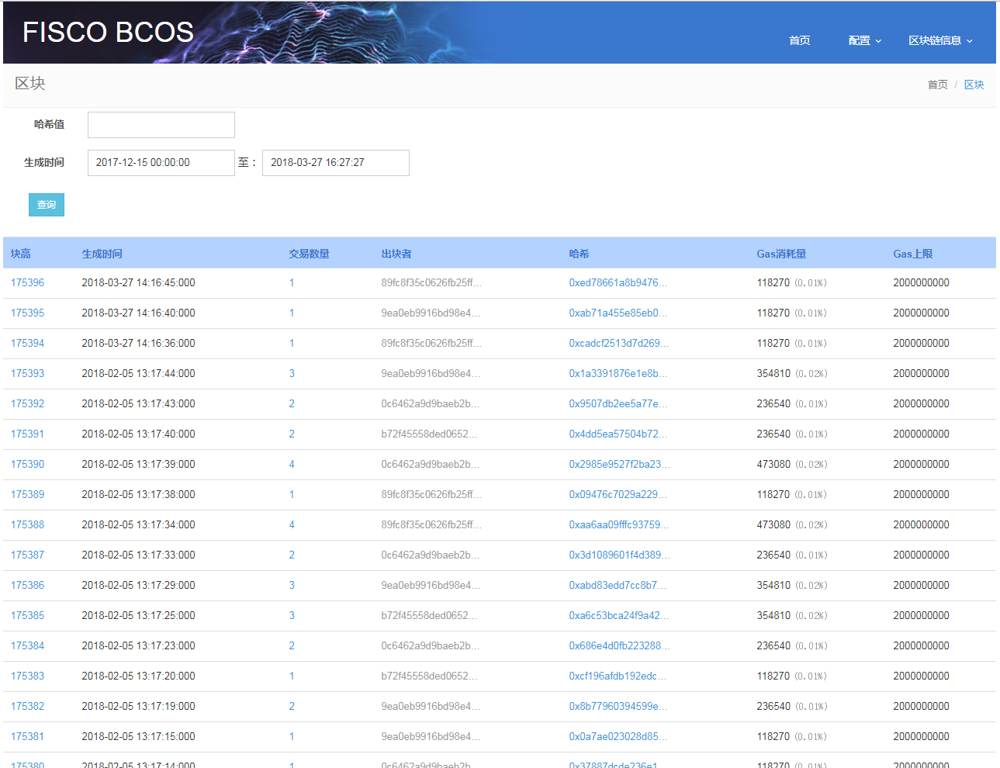

### 3.4 查看监控统计信息

正确部署了report agent后，可查看此处的信息。

#### 3.4.1 统计指标

显示区块链上的各种统计指标折线图。可根据日期，时间，节点，指标等维度进行筛选。

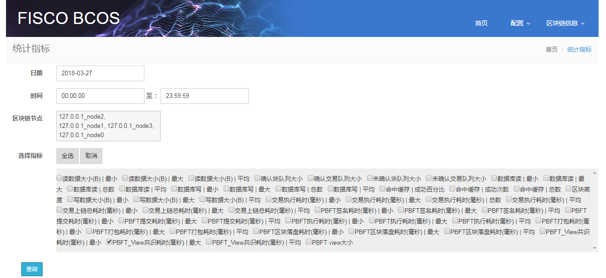

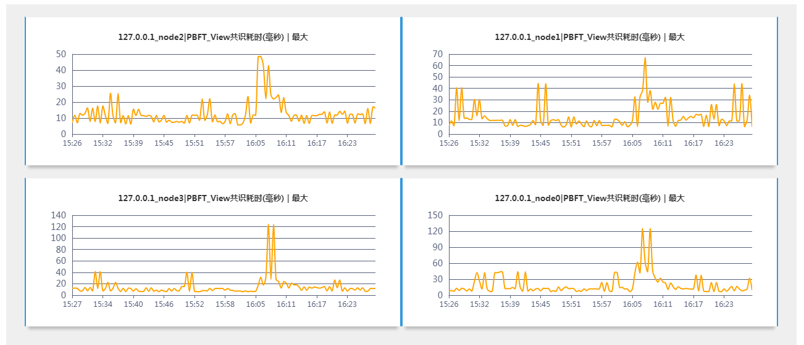

#### 3.4.2 交易流

交易在各个节点被执行的时间点和统计描述。

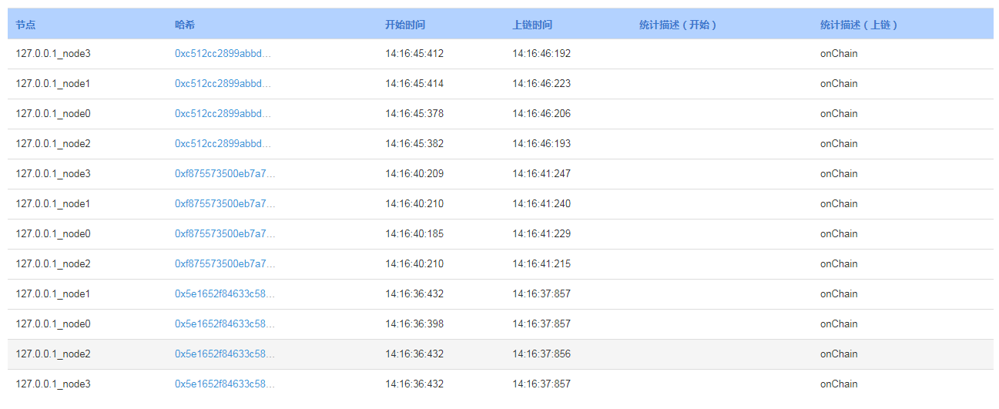

#### 3.4.3 共识流

区块出块流程，在各个节点上的时间点。

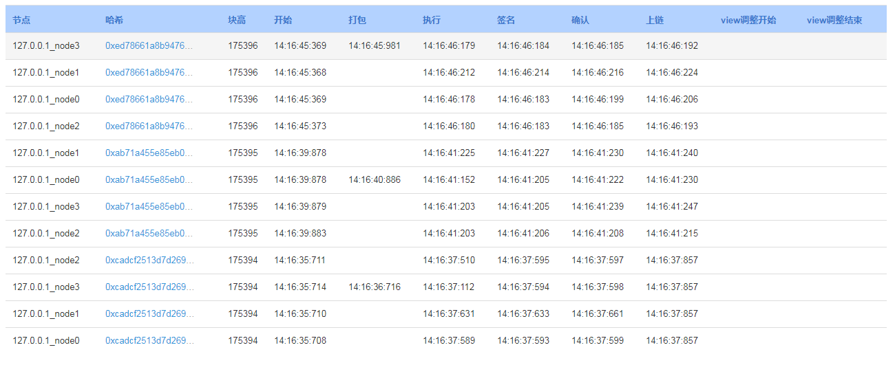


## 四、附录

### 1、Java环境部署

此处给出简单步骤，供快速查阅。更详细的步骤，请参考[官网](http://www.oracle.com/technetwork/java/javase/downloads/index.html)。

（1）从[官网](http://www.oracle.com/technetwork/java/javase/downloads/index.html)下载对应版本的java安装包，并解压到相应目录

```shell
mkdir /software
tar -zxvf jdkXXX.tar.gz /software/
```

（2）配置环境变量

```shell
export JAVA_HOME=/software/jdk1.8.0_141
export PATH=$JAVA_HOME/bin:$PATH 
export CLASSPATH=.:$JAVA_HOME/lib/dt.jar:$JAVA_HOME/lib/tools.jar
```

###2、gradle环境部署

此处给出简单步骤，供快速查阅。更详细的步骤，请参考[官网](http://www.gradle.org/downloads)。

（1）从[官网](http://www.gradle.org/downloads)下载对应版本的gradle安装包，并解压到相应目录。

```shell
mkdir /software/
unzip -d /software/ gradleXXX.zip
```

（2）配置环境变量

```shell
export GRADLE_HOME=/software/gradle-2.14
export PATH=$GRADLE_HOME/bin:$PATH
```

### 3、数据库部署

此处以Centos/Fedora为例。

（1）切换到root

```shell
sudo -s
```

（2）安装mysql

```shell
yum install mysql*
#某些版本的linux，需要安装mariadb，mariadb是mysql的一个分支
yum install mariadb*
```

（3）启动mysql

```shell
service mysqld start
#若安装了mariadb，则使用下面的命令启动
service mariadb start
```

（4）初始化root用户

> 登录数据库

```shell
mysql -u root
```

> 用SQL语句给root分配密码

``` sql
SET PASSWORD FOR 'root'@'localhost' = PASSWORD('123456');
GRANT ALL PRIVILEGES ON *.* TO 'root'@'%' IDENTIFIED BY '123456' WITH GRANT OPTION;
```

### 4、Tomcat操作

（1）部署（以Centos/Fedora为例）

```shell
sudo yum install tomcat
```

（2）部署Web的应用

> 此处即是部署浏览器的page部分，war包的生成请参考[page部署](page/fisco-bcos-browser/README.md)。

```
cp fisco-bcos-browser.war /nemo/tomcat/webapps
```

（3）启动/关闭Tomcat服务

```shell
cd /nemo/tomcat/bin
#启动
./startup.sh
#关闭
./shutdown.sh
```

（4）访问Web

> 浏览器访问URL

```url
http://127.0.0.1:8080/fisco-bcos-browser
```

### 5、gradle build问题

第一次执行时，会下载一些包，请耐心等待。若出现如下的ERROR，可忽略，让其继续运行。之后若出现SUCCESSFUL，则表示build成功。

```shell
[Fatal Error] spring-core-4.1.8.RELEASE.pom:2:127: XML document structures must start and end within the same entity.
```


